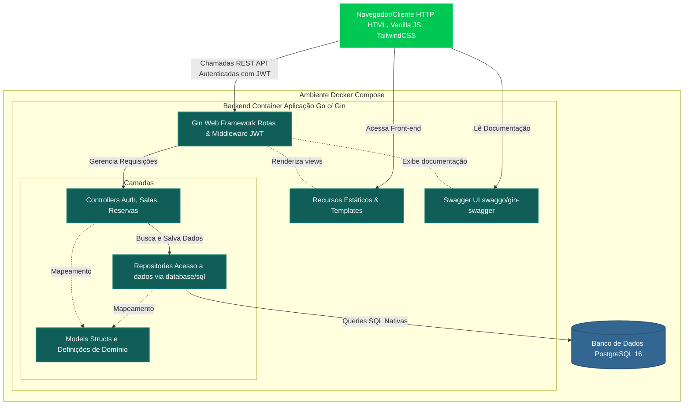

# Arquitetura do Sistema: Agendamento de Salas

Este documento descreve a arquitetura geral do sistema de agendamento corporativo.

## Visão Geral

O sistema baseia-se em uma arquitetura de microserviços simplificada (Monolito Modular) encapsulada em *containers* Docker. 
A stack principal é composta por **Golang e Gin** para a API, e **PostgreSQL** para persistência, com o frontend renderizado e servido pela própria aplicação.

## Diagrama de Blocos C4-Level 2 (Container)

Abaixo o diagrama em Mermaid descrevendo as camadas da aplicação:

## Descrição dos Componentes

1. **Frontend (Cliente):** 
   - SPA híbrido: HTML servido do Go, mas com consumo dinâmico via Fetch API.
   - CSS minificado usando a CLI isolada do TailwindCSS v3 acoplada no pipeline de compilação multi-stage do Docker.
   - Todo controle e redirecionamento de estado acontecem via Vanilla JSON/JS e localStorage tokens.

2. **Backend (App Go):**
   - **Gin Framework:** Garante excelente performance de roteamento HTTP.
   - **Middleware:** Responsável pelo desacoplamento e checagem de Token (JWT).
   - **Camada Controller:** Gerencia HTTP Request/Response unicamente, transferindo dados.
   - **Camada Repository:** Interage com o PostgreSQL através de consultas SQL nativas (`database/sql`) substituindo soluções pesadas como ORMs.

3. **Database (PostgreSQL 16):**
   - Roda encapsulado na mesma virtual network do docker. 
   - A inicialização do DDL e carga primária (Seeding) corre de um script de inicialização `init.sql` na subida primária do driver DB.

4. **Documentação Integrada (Swaggo):**
   - Permite o acesso pelo frontend e geração de artefatos de spec (`swagger.json`/`yaml`) através de comentários nativos no pacote principal.
